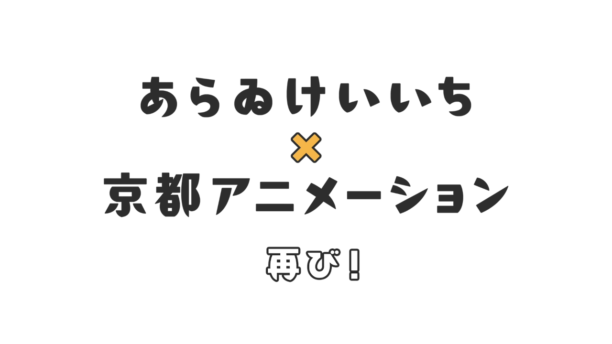

i'm so excited that i even brought this series back, albeit rebranded.

## headlines

### the GOATs are back!

WE'VE NEVER BEEN SO BACK, this is the closest we got to [Nichijou](/reviews/anime/nichijou) season 2! it's kind of [my policy](/help#reviews-style) to avoid getting any exposure to an anime that i haven't watched yet, but it's different when it's something that i know i'm going to watch this no matter what.

@youtube{disclosure id=ldLdilBkwVg caption="『CITY THE ANIMATION』PV第1弾"}

this was the best unexpected news i encountered this month, and they made the PV looked so fun, i could cry. if you know what happened to KyoAni back then, you'd understand why this is such a big deal.

@youtube{disclosure id=YP17uvO9amU caption="『CITY THE ANIMATION』PV第2弾"}

i miss this art style so much, not to mention how much the animation has improved since 2011, the adaptation is always so good! you can also hear how much fun the seiyuus had making this. KyoAni absolutely nailed it with these trailers, i can't believe it premieres on 7th July, just one week from now!

***

## stories

 via [YouTube](https://www.youtube.com/watch?v=IV0-SYn3YuM)")

i might've spoiled you more from that image alone than [the review itself](/reviews/anime/blue-period), but i think that's a great phrase to describe Blue Period. it's doesn't have the best animation, but damn does the story and characters more than make up for it. it might finally be the one that pushes me to start reading manga.

### more

**[Pompo: The Cinéphile](/reviews/movie/eiga-daisuki-pompo-san)** \
less can be more. a movie that changed my perspective on movies and filmmaking.

**[Rascal Does Not Dream of a Sister Venturing Out](/reviews/movie/seishun-buta-yarou-wa-odekake-sister-no-yume-wo-minai)** \
i can't believe i waited this long to watch this, and it's only around 70 minutes long! it doesn't feel that short, which is not a bad thing. oh, you do need to watch the series first, i enjoyed it because i liked the series.

**[Ranma ½ (2024)](/reviews/anime/ranma-½-2024)** \
i wasn't expecting much from Ranma ½, i knew it was a classic remake, but i didn't expect to enjoy it this much. i mean, i did enjoy Urusei Yatsura, so i guess it makes sense in a way.

***

## pieces

")

i'm afraid to say how eerily relatable this article is to me, i need some more time to write my own thoughts about it, but i'll definitely write something similar about this.

### more

**[Thrive in obscurity](https://www.jeetmehta.com/posts/thrive-in-obscurity)** \
ha, if you've read this one, i'm pretty sure you can guess why i included it. can't say i haven't done this myself, but it does remind me to be more intentional about it. to do the things that i enjoy, to push myself, and to create what *i* like. maybe the world will notice, maybe it won't. maybe the world will agree, maybe it won't. but at least i had fun doing it, and that's all that really matters in the end.

***

## tracks

@youtube{id=5Duje_sZko8 caption="[Take Me to the Beach (feat. Ado)](https://music.youtube.com/watch?v=p7DnxRRuqzM) by Imagine Dragons"}

look, i might be a bit biased with Ado, but hear me out. i created a playlist for each month at the start of every month, and somehow this song finds its way and was on every single one of them since it was released. it's *so good*, her vocals are crazy (good) as always!

i think it's time to put it to rest. hopefully with this, i can start fresh with this month's playlist and have less repeats from last month. i'm glad Ado is getting some traction in the global music industry, especially with Imagine Dragons' collaboration.

### more

@youtube{disclosure id=5FrhtahQiRc caption="[Heavy Is The Crown ft. Linkin Park](https://music.youtube.com/watch?v=h0OK2oOG1no) by League of Legends"}

@youtube{disclosure id=jv-laQtaLjE caption="[Let You Fade](https://music.youtube.com/watch?v=I-vcTugsQXY) by Linkin Park"}

@youtube{disclosure id=x1UsJ2Znjk0 caption="[罪と罰 / Crime & Punishment](https://music.youtube.com/watch?v=w_7CXh5s8pk) by Ado"}

@youtube{disclosure id=L5uV3gmOH9g caption="[Teardrops](https://music.youtube.com/watch?v=iKhHd9ySXEw) by Bring Me The Horizon"}

@youtube{disclosure id=L6tHMDaGgho caption="[LosT](https://music.youtube.com/watch?v=1cGSUgX6JTU) by Bring Me The Horizon"}

***

## clips

@youtube{id=p7P8DmTbjUY caption="Surviving Afghanistan's Extreme Street Food!!"}

damn, this was a hard pick. there were so many good videos this month, but i think this one takes the cake. Sony from the [Best Ever Food Review Show](https://www.youtube.com/@BestEverFoodReviewShow) has some of the best content on YouTube, in terms of quality.

i have so much respect for him and his crew, his channel may be centered around "food review", but he doesn't just go to places and eat, he also tells the stories behind the food, the culture we never saw or knew, and the people around it. all of the things that i would never have known if it weren't for him.

### more

@youtube{disclosure id=zxq60I5RSW8 caption="How Nuclear Flies Protect You from Flesh-Eating Parasites"}

@youtube{disclosure id=DTS0o8qCANU caption="Food Theory: Can Humans Survive on Pet Food?"}

@youtube{disclosure id=J5H0t2qm30c caption="China LIED About It's Population"}

@youtube{disclosure id=45JhacvmXV8 caption="Learn to Build With Cardboard!"}

@youtube{disclosure id=j4lgYTS-2Uk caption="The Anime That Gets Adult Romance Right"}

@youtube{disclosure id=gmCZtbKfHQ4 caption="How Too Much Fat Affects Nearly Every Part of Your Body"}

@youtube{disclosure id=TDRenAjxSfk caption="Doctor Reacts To MrBeast Weight Loss Video"}

@youtube{disclosure id=TH6Wq4KWu7M caption="How Japan escaped Obesity while America got Fat"}

@youtube{disclosure id=a4Xsr3Jrvaw caption="Desmos: The Game Engine No One Talks About"}

@youtube{disclosure id=t7eKSJntrNY caption="The illusion that broke the internet"}

@youtube{disclosure id=FEEh7tCM5nQ caption="This Is What a Stroke Does to Your Brain (in Minutes)"}

***

## reflections

i'm glad i finally got to write this (again). there have been so many instances where i thought, "this would be great to include in the monthly series", but i never got around to it. i set the bar too high for myself, overthought everything, and ended up writing nothing at all. which, ironically, only deepened my writer's block.

this month, i was reminded of many things. the most important: i should *just do it*. throw away the perfectionism, stop overthinking, and just create. outputting something is better than nothing. just like my (side) projects — which i finally got around to working on again — what i thought was a daunting task turned out to be much easier than i expected. i just needed to start, and the rest followed.

oh, i also realized that my tracks seem to know me better than i know myself. somehow, they described the events and emotions i went through this month without me even realizing it. yeah, it's another reminder for me to write *that one article* i've been meaning to write.

well, that's all. (hopefully) see you next month.
