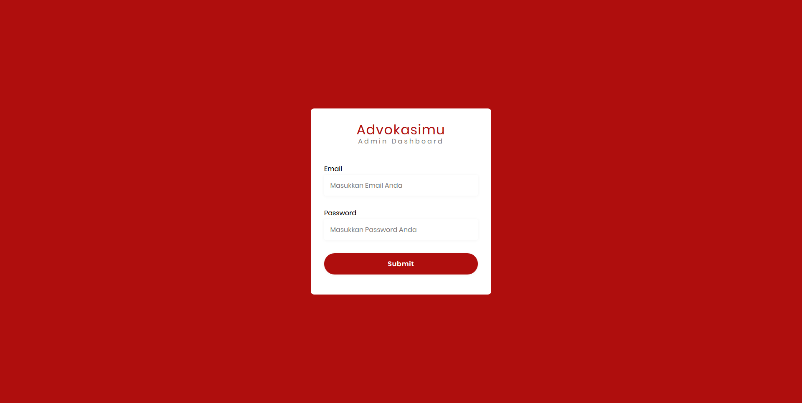
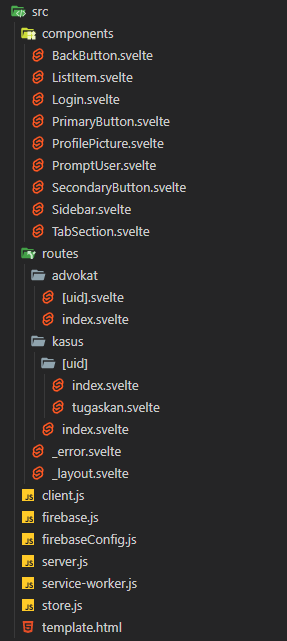
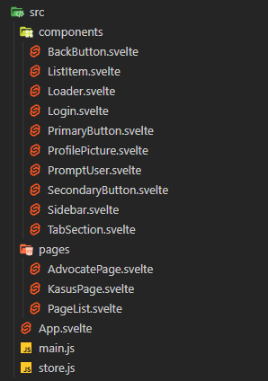
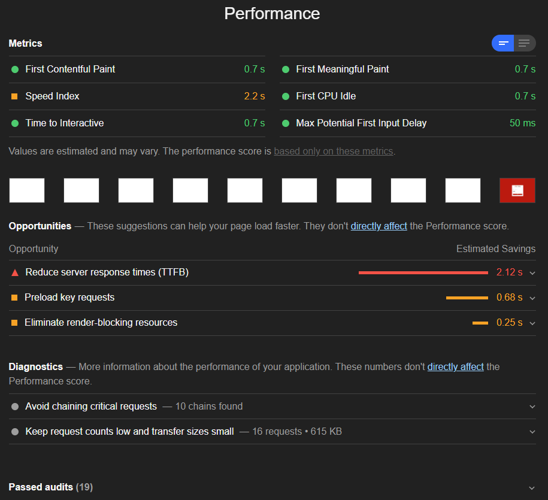
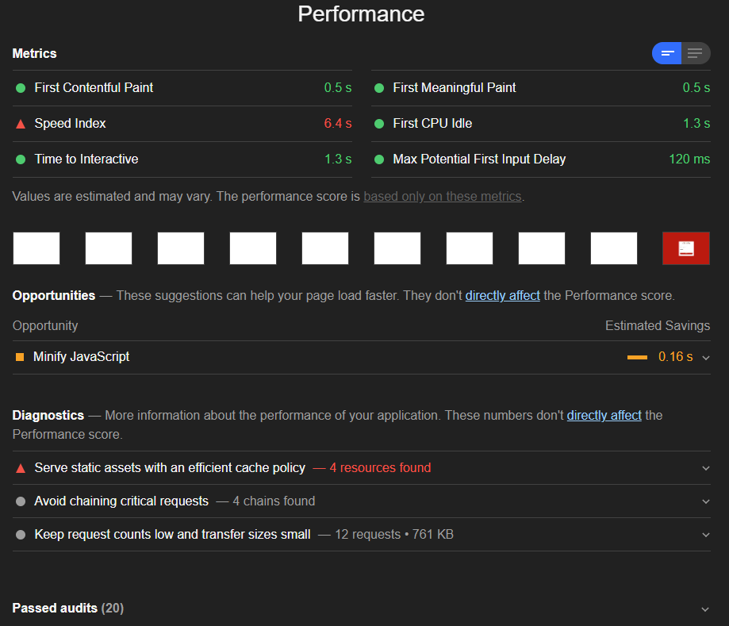
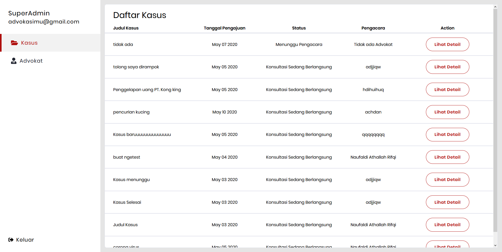
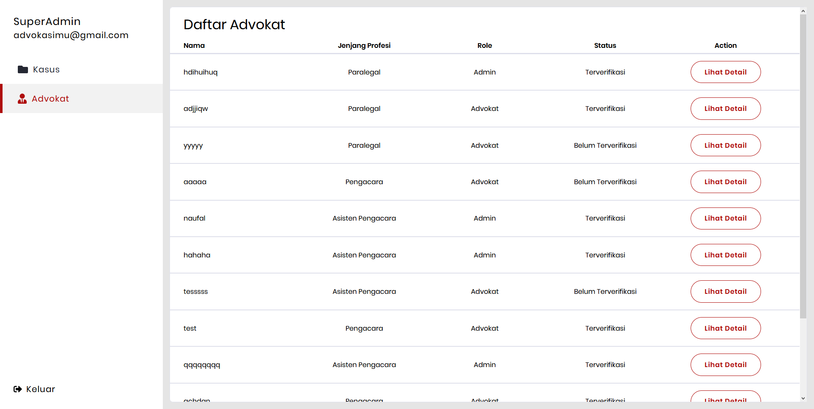

A full-fledged admin dashboard in under 3 hours. Can you really believe it?! It's not really magic, it's just Svelte and good programming practices. This could fall as a massive refactor, though some might say its a rewrite, both points before still stands.

Some context before we continue, my team and I have wrote this admin dashboard the week before with Sapper as a server-side rendered (SSR) application. But, I found out it really doesn't play well with Firebase, so I decided to rewrite it using Svelte as a single-page application (SPA).

## Software architecture

We don't really abide by any official design patterns, the closest we're currently using are probably Strategy or Template pattern. But, we're really just going for the [Component-Based Architecture](https://www.tutorialspoint.com/software_architecture_design/component_based_architecture.htm) approach.

What does it mean by following a certain architecture? Well, it acts as the foundation of the application you're going to build and the principles that determines the system.

By having each individual things isolated as a component in their own file, we reduce the need to write any duplicate codes and applying the Don't Repeat Yourself (DRY) principle. Point being, we're writing cleaner and maintainable code by following this. This has proven itself and you'll see later in this post.

This admin dashboard is a simple web application for admins to simply view and update some data. It's not too complicated and it shouldn't be. We didn't design this with Layered Architecture in mind, but we also didn't plan on making it a God Object. We're still scoping our layers in such a way that each component is going to have their own logic and styling.

For example, one of our components is this `Button.svelte` that scopes the style and encapsulates any logic that happens to just this component.

```svelte
#$ file: Button.svelte
<span on:click>
  <slot />
</span>

<style>
  span {
    cursor: pointer;
    padding: 1em 2em;
    border: none;
    border-radius: 5em;
    background-color: #b90000;
    color: white;
    font-weight: bold;
    letter-spacing: 0.05em;
    text-align: center;
  }
</style>
```

Then, we can just import that component and use it wherever we need to. That `on:click` we declare in `Button.svelte` component is used to forward the event so we can call it where we import it, like so

```svelte
#$ file: App.svelte
<script>
  import Button from './Button.svelte';
</script>

<Button on:click={() => alert('hello')}>
  Say Hello
</Button>
```

Since all of the components are made to be independent, we can literally copy any similar components from our other projects and paste it here, and that is exactly what I did. Of course, this might not apply to all of you, especially if you use third-party CSS libraries. But, because I tend to write my own CSS from scratch, all of my components are fully self-contained and reusable everywhere.

There's of course other components that have more logic than just a plain button. They're going to have their own action handling like Modal popping up when doing something or a Snackbar when something goes wrong.

## Application migration

[](https://sapper.svelte.dev/)

Let's take a look at our previous project structure with Sapper.



It's quite bloated in my opinion, with repeated files in `routes` directory, it's required by Sapper to create the defined routes for the client to navigate to. Though Sapper makes it easy for us to create a path using files as routers, it's not really needed for our case here.

Our components are no different, but all of those files serve as the foundations of our application structure. It may look like a lot of files, but it allows us to reduce our LOC (especially duplicated ones) significantly. So we'll ignore it from our comparison.

```
#$ file: SSR Project Structure
src
├── components
│   ├── BackButton.svelte
│   ├── ListItem.svelte
│   ├── Login.svelte
│   ├── PrimaryButton.svelte
│   ├── ProfilePicture.svelte
│   ├── PromptUser.svelte
│   ├── SecondaryButton.svelte
│   ├── Sidebar.svelte
│   └── TabSection.svelte
├── routes                              #required-by: sapper
│   ├── advokat
│   │   ├── [uid].svelte
│   │   └── index.svelte
│   └── kasus
│       ├── [uid]
│       │   ├── index.svelte
│       │   └── tugaskan.svelte
│       └── index.svelte
├── client.js                           #required-by: sapper
├── firebase.js
├── firebaseConfig.js
├── server.js                           #required-by: sapper
├── service-worker.js                   #required-by: sapper
├── store.js
└── template.html                       #required-by: sapper
```

---

[](https://svelte.dev/)

Now here's the current project structure after our migration to Svelte.



Quite the trim isn't it? We've successfully removed many unnecessary files and even converted our app into a single-page application that could run independently without a backend server. This means we could host our website anywhere that supports static site hosting like GitHub Pages, Netlify, Now, Surge, or others alike.

Choosing to host a server or use a static site is still much of a debate right now, although the majority of developers seems to prefer static site now since it provides a lot more benefits. Keep in mind, it doesn't backend servers are completely obsolete now, but we just don't need it for this project.

```
#$ file: SPA Project Structure
src
├── components
│   ├── BackButton.svelte
│   ├── ListItem.svelte
│   ├── Loader.svelte
│   ├── Login.svelte
│   ├── PrimaryButton.svelte
│   ├── ProfilePicture.svelte
│   ├── PromptUser.svelte
│   ├── SecondaryButton.svelte
│   ├── Sidebar.svelte
│   └── TabSection.svelte
├── pages
│   ├── AdvocatePage.svelte
│   ├── KasusPage.svelte
│   └── PageList.svelte
├── App.svelte
├── main.js
└── store.js
```

Our app is fully contained inside `App.svelte`, I've also separated routes that we have before into their own files in pages directory.

Because our components are self-contained too, I've literally copy and pasted the entire components directory and it will still works. The rest is migrated manually by moving the necessary code from the `routes` pages to either `App.svelte` or `pages` files. This is thanks to the results of using a component-based approach that I'm able to quickly migrate the app just in time.

The only new component I added was `Loader.svelte` to give a more lively app for the user to see while the app is loading. You can see it for yourself or even use this for your own app. Just copy the code below and paste it to the [Svelte REPL](https://svelte.dev/repl)

```svelte
#$ file: Loader.svelte
<script>
  // https://github.com/sw-yx/svelte-data-fetching/blob/master/src/Spinner.svelte
  // courtesy of @sw-yx, modified by @ignatiusmb
</script>

<div>
  <span />
  <span />
  <span />
</div>

<style>
  div {
    display: inline-flex;
    flex-flow: row nowrap;
    align-items: center;
    justify-content: space-between;
    margin: 0 auto;
    padding: 1em;
  }
  div span {
    width: 0.8em;
    height: 0.8em;
    border-radius: 50%;
    background-color: #fc2f70;
    transform: translateY(-100%);
    animation: wave 0.8s ease-in-out alternate infinite;
  }
  div span:nth-of-type(1) {
    animation-delay: -0.4s;
  }
  div span:nth-of-type(2) {
    animation-delay: -0.2s;
  }
  @keyframes wave {
    from {
      transform: translateY(-100%);
    }
    to {
      transform: translateY(100%);
    }
  }
</style>
```

## Why bother migrating

Firebase doesn't integrate that well with Sapper, that's basically the main reason. Of course, we have to acknowledge that Sapper is still in its early development stages (alpha/beta) so expect a lot of things to not play well and breaking changes in the future. With that in mind, it might be enough of a reason to not use it for a long-term project. In addition with its SSR and bundler not playing well with Firebase too, it really hinders our development and client's usage for the website.

In short, we had a hard time developing and our users are going to have a hard time using our website too.

### Firebase not playing well

For some reason, Firebase can't be bundled together with the others and as such requires us to put it in through the `<script>` tags in its `template.html` file to be loaded through a CDN. We then created a function to check to if `firestore` is loaded yet.

```javascript
#$ file: client.js
import * as sapper from '@sapper/app';
import { firebaseConfig } from './firebaseConfig';

const app = firebase.initializeApp(firebaseConfig);
window.auth = app.auth();
window.db = app.firestore();

sapper.start({
  target: document.querySelector('#sapper'),
});
```

`client.js` is Sapper's file of saying anything in this file will be loaded on the client-side. We're initializing firebase here and appending the auth and firestore function to the global `window` object.

```javascript
#$ file: firebase.js
import { firebaseConfig } from './firebaseConfig';

export async function firestore() {
  if (typeof window !== 'undefined') return window.db;

  const firebase = await import('firebase');
  if (!firebase.apps.length) {
    const app = firebase.initializeApp(firebaseConfig);
    return app.firestore();
  } else return firebase.apps[0].firestore();
}
```

By using Sapper, we're relying on its backend server to render the page for the users before it's served to them. Now, since we're using CDN to load our Firebase scripts, every route change requires the Firebase instance to be checked again and wait for it to be loaded again.

Because Sapper's SSR uses node engine from the `<script context="module">` and doesn't have access to the global `window` object, we're going to use the `firebase.js` to check which Firebase instance we're going to use. That's a special script tag that is executed before the page is mounted, Sapper makes use of this to preload its data so it takes the weight for the server to handle.

```svelte
#$ file: kasus/index.svelte
<script context="module">
  import { firestore } from '../../firebase';
  export async function preload(page, session) {
    const db = (await firestore()).collection('kasus');
    const snapshot = await db.get();
    const data = snapshot.docs.map(doc => {
      const data = doc.data();
      data['uid'] = doc.id;
      return data;
    });
    for (const kasus of data) {
      const advokat = await kasus['idAdvokat'].get();
      kasus['advokat'] = { id: advokat.id, nama: advokat.data().nama };
    }
    return { data };
  }
</script>

<script>
  export let data;
</script>

...
```

Because we're importing Firebase every time the route changes, it puts unnecessary load and time just to check and load Firebase again. Our main problem comes with the layout

```svelte
#$ file: _layout.svelte
<script>
  export let segment;
  import Sidebar from '../components/Sidebar.svelte';
  import Login from '../components/Login.svelte';

  import { onMount } from 'svelte';
  import { firestore } from '../firebase';
  import { admin } from '../store';
  import { stores } from '@sapper/app';
  const { page, session } = stores();
  const { path } = $page;
  onMount(async () => {
    const seg = path.slice(1).split('/');
    if (!$session && (seg.length > 1 || seg[0] !== 'kasus')) {
      window.location = 'kasus';
    }
    $session = auth.currentUser;
    if ($session) {
      const db = (await firestore()).collection('users');
      $admin = (await db.doc($session.uid).get()).data();
    }
  });
</script>

{#if $admin}
  <Sidebar {segment} />
  <main>
    <div>
      <slot />
    </div>
  </main>
{:else}
  <Login />
{/if}
```

This is really dirty and what I consider a *hackjob*. Remember that this app is intended to be used by admins only, so anyone that is not logged in can't access anything. `_layout.svelte` file is the main layout inherited by all of the `routes` files, anyone visiting the page will be handled by layout first and checked if `$admin` or in other words, is logged in, then they'll get the `Sidebar` and main content inside `slot`.

Every time the user changes routes, it triggers the if logic in layout. Since we've saved our logged in user data in the `$admin` store, it won't need to check directly to Firebase again. But, when the user refreshes, the store is cleared and the process restarts. Also, our plan to use absolute paths didn't work and we need to reload the page to the root index for Firebase to load for some reason.

All of the code above could be avoided by migrating to just Svelte. We'll look at it later.

### Unnecessary backend server

Since we're using Firebase, it basically acts as our backend server too. We only need to send our requests and everything can be handled on client-side. Especially when this app is specifically only used by admins that needs to login before being able to do anything else, routes or absolute paths and search engine optimization (SEO) is just unnecessary.

### SPA over SSR

As I've said before, we just don't need a backend server since we're using Firebase that acts as our backend. We don't have expendable budgets and the time to setup any server as well.

Of course, the performance difference is significant as well, especially after we've tested both in production mode. Some of you might say the initial load will be longer since it's a SPA, but keep in mind that it will be cached and most of the operations will happen after login and that's where the user would feel the most impact on waiting time.

## Performance audit

This is the audit results for our SSR application




---

This is the audit results for our SPA application




Let's ignore Accessibility and SEO since this is specifically made for desktop use and we don't really intend this for public use. Best Practices on the other hand is the exact same so you know that we literally migrated the app with no major changes between it.

The performance however might not meet your expectations. It didn't meet my expectations as well because in real-life use of the SPA app it did extremely well and everyone that tested both said the same thing. However, since this is an app intended for private use and Lighthouse audit can only score the initial load, we might as well take a look at it.

You might see that our SPA app is 13 points below our SSR app. It took a huge blow from the speed index, but it's specifically because of that. Since our app acts as a SPA, everything gets loaded at the beginning and all of it gets loaded at once, but once it has loaded, everything is butter smooth.

Looking at the opportunities, diagnostics, and passed audits, our SPA app performs better than our SSR counterpart. I think this shows how some tests can't really cover all aspects of what makes a good product.

## Svelte technical stuff

Just Svelte itself is so simple and easy to use. It provides quick application development workflow and its results are so good. Here's how we integrate Firebase with Svelte and we'll be using a package called `sveltefire`

```svelte
#$ file: App.svelte
<script>
  import { FirebaseApp, User, Doc, Collection } from 'sveltefire';
  import firebase from 'firebase/app';
  import 'firebase/firestore';
  import 'firebase/auth';

  const firebaseConfig = {
    apiKey: '',
    authDomain: '',
    databaseURL: '',
    projectId: '',
    storageBucket: '',
    messagingSenderId: '',
    appId: '',
    measurementId: ''
  };
  firebase.initializeApp(firebaseConfig);
</script>

<FirebaseApp {firebase}>
  <!-- All logic that needs Firebase, which is everything -->
</FirebaseApp>
```

`sveltefire` handles anything Firebase related in its nested components. Since we always need our Firebase client for anything the user do, we'll do all of our logic inside the `<FirebaseApp>` tag, imported from `sveltefire` in the first line of the script.

Inside the `<FirebaseApp>` tag, we'll handle everything including our sign-in handling and signed in user data.

```svelte
#$ file: App.svelte
<script>
  import Login from './components/Login.svelte';

  import { tab, action, assign } from './store';

  let error = '';
  async function signIn(event, auth, admins) {
    error = '';
    const { email, password } = event.detail;
    let valids = admins.map(admin => admin.email);
    if (!valids.includes(email)) return (error = "You're not admin.");
    auth.signInWithEmailAndPassword(email, password).catch(function(err) {
      if (err.code === 'auth/wrong-password') error = 'Wrong password.';
      else error = err.message;
    });
    $tab = 'kasus';
    $action = null;
  }
</script>

<FirebaseApp {firebase}>
  <User let:user let:auth persist={sessionStorage}>
    <div slot="signed-out">
      <Collection path={'users'} {query} let:data>
        <Login on:login={e => signIn(e, auth, data)} {error} />
      </Collection>
    </div>

    <main>

      <Doc path={`users/${user.uid}`} let:data={admin}>
        <Sidebar {auth} {admin} />

        <article>
          <!-- Routing and page logic -->
        </article>
      </Doc>

    </main>
  </User>
</FirebaseApp>
```

`<User>` tag provides us context to `currentUser` from Firebase auth. We handle users that's not logged in in the `signed-out` slot. It calls the `Login` component that dispatches a login event to use with the username and password passed as its data. We wrap our `Login` component with a `Collection` of users to get the context of all available users to check whether their role is admin or not.

When the user is logged in, it enters the `<main>` tag and they're given a `<Sidebar>` with `auth` prop from `<User>` for signing out and `admin` data from `<Doc>` to get the `currentUser` email and data such as role and authorities.

```javascript
#$ file: store.js
import { writable } from 'svelte/store';

export const tab = writable('kasus');
export const action = writable(null);
export const assign = writable(null);
```

`store.js` just contains writable stores for all svelte files to use. It's basically a global state container to pass data without passing props up and down through the tree.

```svelte
#$ file: Login.svelte
<script>
  export let error;

  import { createEventDispatcher } from 'svelte';
  const dispatch = createEventDispatcher();
  let email, password;
</script>

<main>
  <article>
    <h1>Advokasimu</h1>
    <p>Admin Dashboard</p>
    <form on:submit|preventDefault={() => dispatch('login', { email, password })}>
      <label for="email">
        <span>Email</span>
        <input type="email" placeholder="Enter your Email" bind:value={email} />
      </label>
      <label for="password">
        <span>Password</span>
        <input type="password" placeholder="Enter your Password" bind:value={password} />
      </label>
      {#if error}
        <label for="error">{error}</label>
      {/if}
      <input type="submit" value="Submit" />
    </form>
  </article>
</main>
```

`Login.svelte` receives an `error` prop to show when it's not an empty string. It also passes a dispatched event on form submit with `preventDefault` preventing the default behavior from executing. Using Svelte's two-way binding `bind:value`, we pass the inputs from the filled in form as an object to dispatch for `App.svelte` to be processed.





```svelte
#$ file: App.svelte
<script>
  import { tab, action, assign } from './store';
</script>

<FirebaseApp {firebase}>
  <User let:user let:auth persist={sessionStorage}>
    <main>

      <Doc path={`users/${user.uid}`} let:data={admin}>
        <Sidebar {auth} {admin} />

        <article>

          {#if $tab === 'kasus'}
            <!-- Kasus Page -->
            {#if $action && $assign}
              <!-- If there's action and is assigning -->
            {:else if $action}
              <!-- If there's action in Kasus Page -->
            {:else}
              <!-- Look at kasus list -->
            {/if}
          {:else if $tab === 'advokat'}
            <!-- Advocate Page -->
            {#if $action}
              <!-- If there's action in Advocate Page -->
            {:else}
              <!-- Look at advocates list -->
            {/if}
          {/if}

        </article>
      </Doc>

    </main>
  </User>
</FirebaseApp>
```

Previously, we're relying on Sapper built-in file-based routing system to give us each scope. But, we don't have that luxury here and as such, we're using the store we created before. By checking if tabStore is equal to a certain string, we know that the user is currently requesting to be in that page so we'll give them the content from that page.

Using and managing svelte store is quite tricky to do manually, so we'll be using Svelte dollar sign ($) syntactic sugar to automatically `subscribe`, `unsubscribe`, and `set` the store. It will prevent stack overflows and other unexpected behaviors you don't necessarily think about.

Here's one of the pages with actions and sub-action (assign), one of the tricky ones for me

```svelte
#$ file: App.svelte
<script>
  import { tab, action, assign } from './store';

  let show = {};
</script>

...
{#if $tab === 'kasus'}
  <!-- Kasus Page -->
  {#if $action && $assign}
    <!-- If there's action and is assigning -->
    <Collection path={'users'} {query} let:data={users}>
      <div slot="loading">
        <Loader />
      </div>

      <PageList>
        <Doc path={$assign.path} let:data={kasus} let:ref>
          {#each users as { id, ...advokat }}
            {#if advokat.isVerified && id !== kasus['idAdvokat'].id && !advokat.isSuper}
              <ListItem>
                <span>{advokat.name}</span>
                <span>{advokat.profession}</span>
                <span>{advokat.isAdmin ? 'Admin' : 'Advokat'}</span>
                <span>{advokat.isVerified ? 'Verified' : 'Not Verified'}</span>
                <SecondaryButton on:click={() => (show[id] = !show[id])}>
                  Assign
                </SecondaryButton>
                <PromptUser show={show[id]} on:click={() => (show[id] = !show[id])}>
                  Are you sure to assign {kasus.title} to {advokat.name}?
                  <aside name="buttons">
                    <SecondaryButton on:click={() => (show[id] = !show[id])}>
                      Cancel
                    </SecondaryButton>
                    <PrimaryButton
                      on:click={() => {
                        $assign.update({ idAdvokat: advokat.ref, status: 1 });
                        show[id] = {};
                        $assign = null;
                      }}>
                      Yes, Assign Advocate
                    </PrimaryButton>
                  </aside>
                </PromptUser>
              </ListItem>
            {/if}
          {/each}
        </Doc>
      </PageList>
    </Collection>
  {:else if $action}
    <!-- If there's action in Kasus Page -->
  {:else}
    <!-- Look at kasus list -->
  {/if}
{:else if $tab === 'advokat'}
  <!-- Advocate Page -->
  {#if $action}
    <!-- If there's action in Advocate Page -->
  {:else}
    <!-- Look at advocates list -->
  {/if}
{/if}
...
```

`loading` slot have a `<Loader>` as its child to show when the data, in this case `Collection` of users, is still loading. We then loop for each users as `{ id, ...advokat }`, this is a destructuring as well as spread syntax, it means we're immediately extracting each user by its `id` and saving the rest of the data into a variable called `advokat`.

We also check if the advocate `isVerified`, does not have the same `id` as the `id` in the current case, and is not a super admin. It means, we don't want any advocate that hasn't been verified to work on the case, or is already in the case, or is a super admin.

`<PromptUser>` is a modal that receives a `show` prop and `on:click` event.

```svelte
#$ file: PromptUser.svelte
<script>
  export let show;
  import { fly } from 'svelte/transition';
</script>

{#if show}
  <div class="backdrop" on:click|self>
    <section transition:fly={{ duration: 250 }}>
      <div>
        <slot />
      </div>
      <slot name="buttons" />
    </section>
  </div>
{/if}
```

It's basically just a simple Svelte modal with transition applied to it. `show` prop indicates whether the modal is showed or not. The `on:click` on `App.svelte` is just toggling the boolean of `show` prop. With the event modifier `self`, it prevent clicks on other DOM nodes other than itself so it won't close when it's clicked in the `<section>` tag.

We're also using a dictionary (could be array too) to store the show booleans, since there will be a lot of `<PromptUser>` modal created, a single variable will open all the modal at once.

Finally, clicking on the `<PrimaryButton>` triggers the update function on the document reference. It then resets the show variable to an empty dictionary and closes the page by resetting the `assign` store back to null.

That wraps up this post of admin dashboard migration with Svelte and Firebase. If you've got any questions you can contact me through any of the social links in the footer below. Cheers!

---
Reference(s):

- <https://svelte.dev/docs>
- <https://sapper.svelte.dev/docs>
- <https://github.com/codediodeio/sveltefire/>
