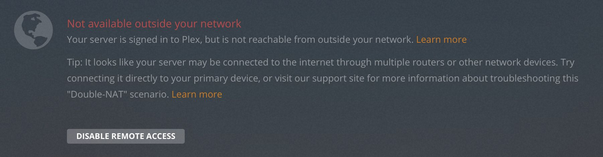
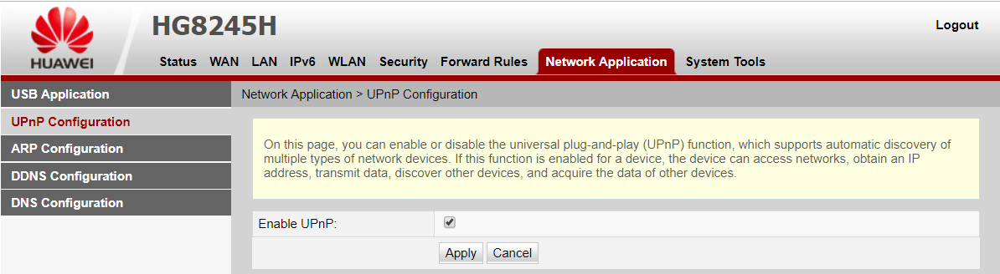
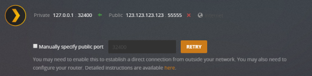
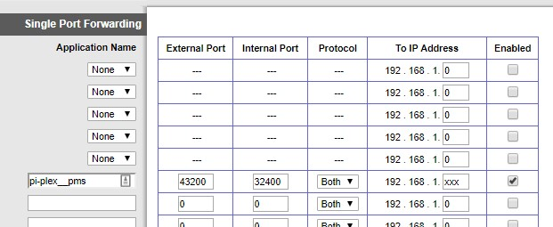
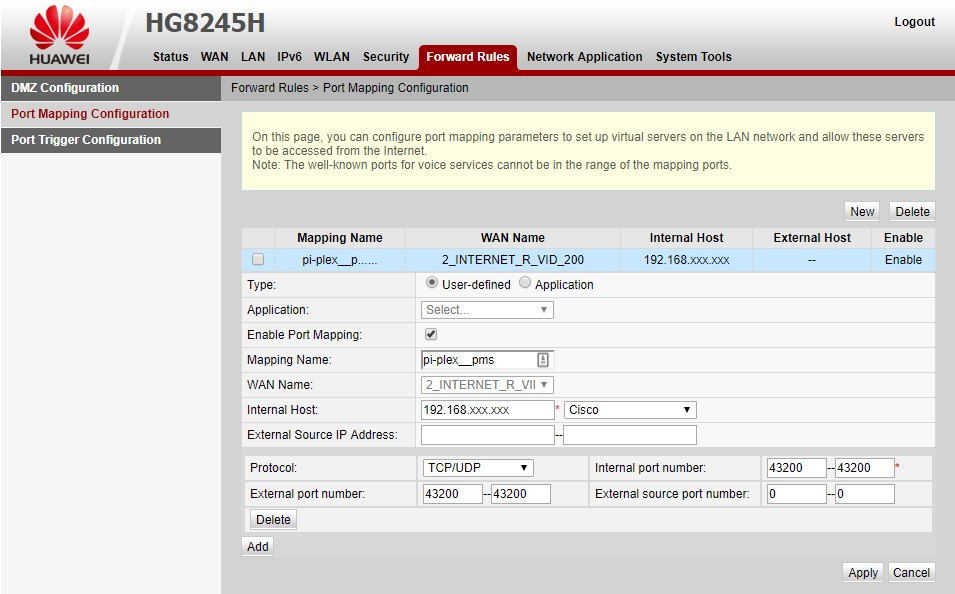
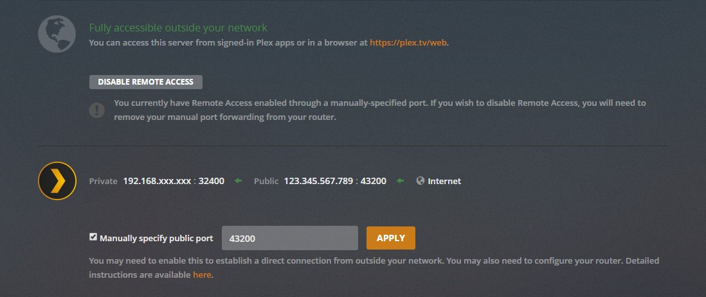

i ran into a persistent error with Plex that lasted for months before i traced it to a double-NAT issue. if you see the same, here's how to detect and fix it.



[NAT](https://en.wikipedia.org/wiki/Network_address_translation) or Network Address Translation is what lets multiple devices share a single internet connection. most home routers use NAT by default. Double-NAT happens when *two* devices in your network are both performing NAT. for example: your ISP modem handles NAT, then your own router also does NAT on top of it. this causes Plex to struggle because connections can't map through cleanly.

---

before messing with your network and ports manually, try enabling **UPnP** (universal plug and play) on your router first. some apps can configure themselves automatically if UPnP is enabled.




---

## detecting double-NAT

first, try to count how many modems/routers you have. if only one device, you probably don't have double-NAT and the issue lies elsewhere.

if the device connects directly to your ISP, you're fine. however, if your router connects to *another* modem/router, you likely have double-NAT.

### trace your packets

use `traceroute` on Linux/Mac or `tracert` on Windows and look at the first two hops. if both show private IP ranges (e.g. `192.168.x.x`), you're behind double-NAT.

```shell file:Windows
tracert 8.8.8.8
```

```bash file:Linux
traceroute 8.8.8.8
```


## fixing double-NAT

the cleanest solution is to set the first device in **bridge mode** so only one device does NAT. if that's not an option, you'll need chained port forwarding: forwarding on both routers until the request reaches your server.

```shell file:Windows
ipconfig /all
```

find your local IP and set it static (so the forwards stay consistent). note your app's port. plex uses `32400`; minecraft uses `25565`; choose appropriately. stick to high ranges (`40000–60000`) if you pick a custom external port, to avoid collisions. in Plex, manually specify the public port (e.g. `43200`).



on your first router (first hop in `tracert`), forward the app's port (`32400`) to the external port you chose (e.g. `43200`). use both TCP/UDP protocols, and point it to your static local IP (e.g. `192.168.1.xxx`).



on your second router (second hop in `tracert`), forward the same external port you chose (e.g. `43200`) to the same internal port (`43200`), so it passes through cleanly.



check your app again — red should now be green.


