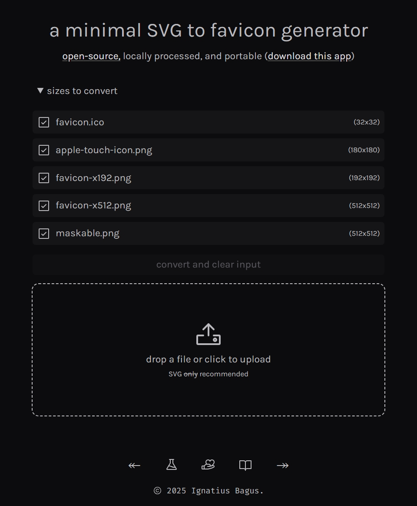
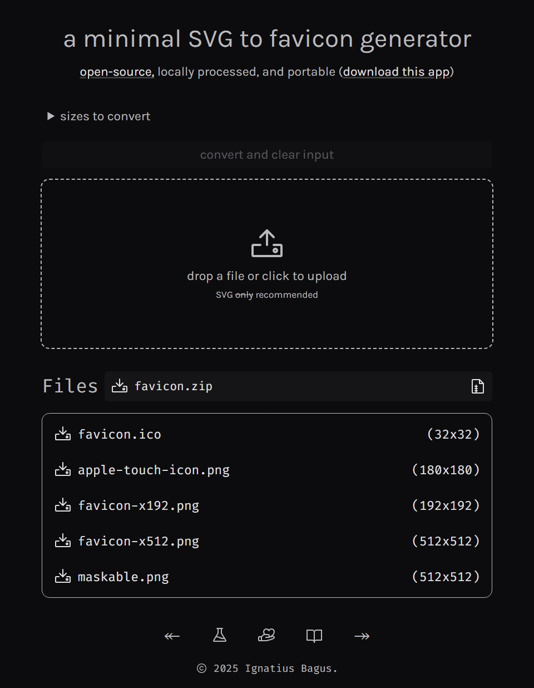

lately, ideas have been pouring in faster than i can manage, and i've felt the urge to chase and iterate on all of them. i know — it's unrealistic to think i have the time or energy for everything, but i try anyway. *\*cue the pile of unfinished side projects watching me start another one\**

naming things is still as hard as ever. and now, i have to deal with designing a logo (favicon) that, not only needs to fit the name, but also be eligible and visually discernible in the miniscule browser tab.

## how to favicon

creating logos is a separate rabbit hole that i've already fallen into and spent far too much time in, but let's set that aside for now and assume we have an SVG logo we want to use as our favicon, what now?

the first thing that comes up when i tried to learn *the way* to do favicons is [How to Favicon](https://evilmartians.com/chronicles/how-to-favicon-in-2021-six-files-that-fit-most-needs) by Evil Martians. it's an amazing and comprehensive post that's been updated since it was first published in 2021, nice!

however, the problem i experienced after going through all the steps and generating the set of files is that *i wasn't happy with the logo*. i know, it's a *me-problem*, i tend to ruminate too much on the things i do and want. as a result, i end up needing to redo the whole process again, multiple times.

obviously, this wouldn't be a problem if i had a good logo to begin, but i'm also learning to make my own logo as i go along, and i keep ~~changing my mind~~ iterating on the design. so, i can't possibly do the whole song and dance with [GIMP](https://www.gimp.org/) (great software, btw) every time i updated the SVG, it's tedious!

and then, i remembered that i'm a software developer, and i can spend (definitely more than 8) hours to *automate* the repetitive process instead of the (barely) 5 minutes it takes to do manually. hey, it's a long-term investment, right? *\*copium\**

## breaking it down

a good first step when encountering a problem is to break it down into smaller, manageable parts. in this case, once i've set up the `<link>` tags and `.webmanifest` file, the only thing left to do is to put the icon files in the right place. once it's there, i can just update the files every time i want to change the logo.

next up is to figure out what i'm working with and what the end result should be. in this case, i wanted the *original* logo to be in SVG format because i like coding my logo. the output should be a set of favicon files i've already defined, which are:

- `favicon.ico`
- `apple-touch-icon.png`
- `favicon-x192.png`
- `favicon-x512.png`
- `maskable.png`

## building the thing

before i can start writing any code, i need to scaffold the project first. for standalone projects, i usually unzip [ignatiusmb/starter](/atelier#ignatiusmb-starter) and start from there. however, since i imagine this as an extension of Alkamauss, i decided to make it a part of [the digital garden monorepo](https://github.com/ignatiusmb/mauss.dev), which means it's as easy as creating a new directory in the workspace and adding a (also *minimal*) `package.json` file. hooray for monorepos.

### bind for you

i'm using Svelte and it almost always has a declarative way of doing things, i like not having to declare `let` variables and mutate them, fewer things to name and manage, y'know? however, working with `<input type="file">` is always a bit tricky, and this time is no exception.

i ended up resorting to `let files` and [`bind:files`](https://svelte.dev/docs/svelte/bind#input-bind:files) to manage the file input. yeah, there's a special `bind:` directive just for file inputs. once the file is uploaded, `files` will immediately be a `FileList` object with the uploaded file(s), which is just one in this case.

### rasterization

after having access to the uploaded SVG file, the next step is to rasterize it into PNG files. this part is actually quite straightforward. here's the function that does it:

```typescript
async function png(raw: string, image: number, size: number): Promise<Blob> {
    const svg = new Blob([raw], { type: 'image/svg+xml' });
    const url = URL.createObjectURL(svg);

    const canvas = document.createElement('canvas');
    canvas.width = canvas.height = size;
    const ctx = canvas.getContext('2d')!;
    ctx.clearRect(0, 0, size, size);
    const offset = (size - image) / 2;

    return await new Promise((resolve) => {
        const img = new Image();
        img.onload = () => {
            ctx.drawImage(img, offset, offset, image, image);
            URL.revokeObjectURL(url);
            canvas.toBlob((blob) => resolve(blob!), 'image/png');
        };
        img.onerror = () => resolve(new Blob());
        img.src = url;
    });
}
```

i'm sure you can figure out what this does, the bulk of the work is done by the detached `canvas` element. the resulting PNG is generated by calling `canvas.toBlob()` after drawing the image on the canvas.

with this function, i've *technically* completed 80% of the work, which covers generating 4 out of the 5 image files needed. of course, the first 80% only takes 20% of the time, and the remaining 20% takes 80% of the time (*subtle foreshadowing*). **Pareto principle** at its finest, right?

### ICOnize

all that's left is to generate the `favicon.ico` file. but, what is an `.ico` file anyway? can't i just change the extension from `.png` to `.ico`? haha, of course not. file extensions are just a convention, which is different from the actual file format.

remember back in the day when Wikipedia wasn't considered a reliable source and we had to find "proper" articles to cite? no? okay, maybe it's just me. anyway, the [ICO file format](https://en.wikipedia.org/wiki/ICO_(file_format)) is basically a container for multiple images, it can contain both PNG and BMP images, and it's most commonly associated with Windows icons because.. well, it was developed by Microsoft.

using the `.ico` file created with GIMP as the control, it converts the image to BMP and wraps it in the ICO container. while we *usually* want a BMP image in the container for Windows icons, we don't really need it for the web since almost all browsers support PNG in ICO these days. PNG also takes up less space, i can reuse the `png()` function, and quality won't matter that much when the image is crammed into a `32x32` box. the only downside is that the resulting ICO will not have a preview image in Windows Explorer, but when will i ever work with `.ico` files again outside of favicons? `¯\_(ツ)_/¯`

doing low-level binary encoding is not something i usually do, and especially not in JavaScript as it only have a limited set of data types. not the `Uint8Array` or the other typed arrays, but the `typeof` values like `number`, `string`, and `boolean`. fortunately, i survived uni and reading the Wiki article is easier than trying to decipher the lecturer's notes and slides. utilizing the fact that i'm only embedding **one PNG image**, i can hardcode the `ICONDIR` and most of the `ICONDIRENTRY` structures. the resulting function is as follows:

```typescript
async function ico(raw: string, size: number): Promise<Blob> {
    const blob = await png(raw, size, size);
    const offset = 6 + 16 * 1; // header + one entry

    const buffer = new Uint8Array(await blob.arrayBuffer());
    const header = new Uint8Array([0x00, 0x00, 0x01, 0x00, 0x01, 0x00]);
    const entry = new Uint8Array([
        size,
        size,
        0x00,
        0x00,
        0x01,
        0x00,
        0x20,
        0x00,
        // image size
        (size >> (8 * 0)) & 0xff,
        (size >> (8 * 1)) & 0xff,
        (size >> (8 * 2)) & 0xff,
        (size >> (8 * 3)) & 0xff,
        // offset
        (offset >> (8 * 0)) & 0xff,
        (offset >> (8 * 1)) & 0xff,
        (offset >> (8 * 2)) & 0xff,
        (offset >> (8 * 3)) & 0xff,
    ]);

    const bytes = new Uint8Array(header.length + entry.length + buffer.length);
    bytes.set(header, 0);
    bytes.set(entry, header.length);
    bytes.set(buffer, header.length + entry.length);
    return new Blob([bytes], { type: 'image/x-icon' });
}
```

yeah, it's a bit more work than the `png()` function — but it's essentially a wrapper around it. double-checking the `.ico` file in a hex editor like [HexEd.it](https://hexed.it/) shows that it has the correct header and the image data is in the right place. all set, on to the next one!

### serving the blobs

notice that both `png()` and `ico()` function returns a (promised) `Blob`, which is a binary representation of the image data. this makes it convenient to generate the download links from the generated files, all it needs is an `<a>` tag with a `href` pointing to the `Blob` URL and a `download` attribute. this is how the download links are generated:

```svelte
{#each [/* the generated file objects */] as { name, blob }}
    <a href={URL.createObjectURL(blob)} download={name}>{name}</a>
{/each}
```

the `{#each}` block is just Svelte's syntax for iterating over an array. what matters is that the `href` is set to the string returned by `URL.createObjectURL(blob)`, which creates a temporary URL that points to the `Blob` data, and the `download` attribute is set to the desired filename which also allows the user to download the file when they click the link.

### that's it.. right?

yes, *technically*, it's done. the project is feature-complete, it's usable, and it meets all the MVP checkboxes i set for myself at the beginning. i should be done, i should've stopped here and moved on. but *i didn't*. `ಠ_ಠ`

### ZIP-em-up

yes, all the files are generated and can be downloaded individually, but i want them to be zipped up nicely in a single download. i don't want to click multiple times and download each file manually, and i don't like the idea of a button that downloads all of them and spills the files all over the Downloads directory.

now, any sane person would've used a library and be done with it. but, as you can probably guess by now, i seem to enjoy pain a bit much by doing things the hard way. so, i implemented my own ZIP archiver, without compression! i don't hate myself that much, please.

after another few hours down the rabbit hole and reading the [ZIP file format](https://en.wikipedia.org/wiki/ZIP_(file_format)) specs, i managed to cram the bulk of it in about 100 lines of code inside the `zip()` function, excluding the couple of helper functions. i won't bore you with the details here, it's more or less the same with the ICO encoding, but with a few more metadata to deal with.

### self-contained

as a bonus and a reward to myself for all the hard work on making it minimal and everything work on the browser, i decided to try out the [`bundleStrategy: 'inline'`](https://svelte.dev/docs/kit/configuration#output) option from SvelteKit to make the whole app self-contained in a single HTML file.

the only thing left is to prerender the app (or the single page, in this case). for a generator app that relies on JavaScript, it wouldn't make sense to do progressive enhancement as none of the features would work without JavaScript. also, i want everything to work locally on the client's browser, so falling back to SSR is not an option.

wow, that's a long way of saying that i need the app to essentially be a [single-page app](https://svelte.dev/docs/kit/single-page-apps) (SPA). but, there's a reason why i explained all of this, and it's because SvelteKit has a "new" way of creating SPAs, which is to set the `router.type` to `'hash'` in the `svelte.config.js` file. it disables SSR and prerendering, which means it will fully rely on client-side rendering (CSR), and since we're inlining everything, it will generate a fully self-contained HTML file that can be opened in any browser, even without a web server, directly with the `file:` protocol.

the final HTML file is about `314 KB` in size, including the fonts. what surprises me was that using non-variable fonts resulted in a larger file size around `370 KB`, even though i made sure to only include one weight and style for each font. without fonts, the file size drops to about `97,5 KB`, which could be reduced further by removing icons and other stylistic elements. but then again, *perfection is attained not when there is nothing more to add, but when there is nothing left to take away* — from *Wind, Sand and Stars* by Antoine de Saint-Exupéry.

## it's live!

the app is live at [favicon.mauss.dev](https://favicon.mauss.dev) and you can try it out right now. you can also take it with you wherever you go (i'm not here to judge), it is self-contained in a single HTML file after all. no tracking and definitely no ads, *pinky promise*. well, only the basic visitor's analytics, and it's off if you download the file. you can audit the code yourself if you want to, the source code is linked below at the end of my [reflections](#reflections).



i initially wrote "SVG only" in the input label, but it does seem to work with other image formats as well. though, i'm 99% certain that the results won't be as crisp as an SVG file.

some extra features i didn't mention in the previous section are mostly UX stuff, like drag-and drop support and checkboxes to toggle the sizes to generate.



i hope the UI is intuitive enough, i spent some time thinking about where to place the button to download the ZIP file.

## reflections

it's been a while since i learned as much as i did with this project, and even if it's (what we consider) a simple project, we can learn a lot from it. it was intimidating at first, the specs looked complicated, and i only had a vague idea of where to start. but now, here i am writing this post for you. this goes to show that we can do anything we set our minds to, take one step at a time, as long as we're moving forward, we'll get there eventually.

this is just a personal quirk — i like setting arbitrary constraints for myself. for example, only using the platform APIs and not relying on any third-party libraries. it made me think outside the box and force myself to come up with solutions that i wouldn't have learned otherwise. oh, please do not take this as a recommendation, i would've used a library if i didn't have the luxury of time and the desire to learn. there are many times i was pressed for time and just needed to get things done, and i would've used a library in those cases. then again, since i've made a lot of utilities myself, the libraries i use are usually my own at the end of the day.

i hope you enjoyed reading this post as much as i did writing it. it's been a while since i geeked out about something like this. visit the app or download it! also check out [the source code on GitHub](https://github.com/ignatiusmb/mauss.dev/tree/master/workspace/favicon) if you're interested, which includes the source code for this site as well. [i'm available anywhere here](/about#elsewhere), hope to see you around.
